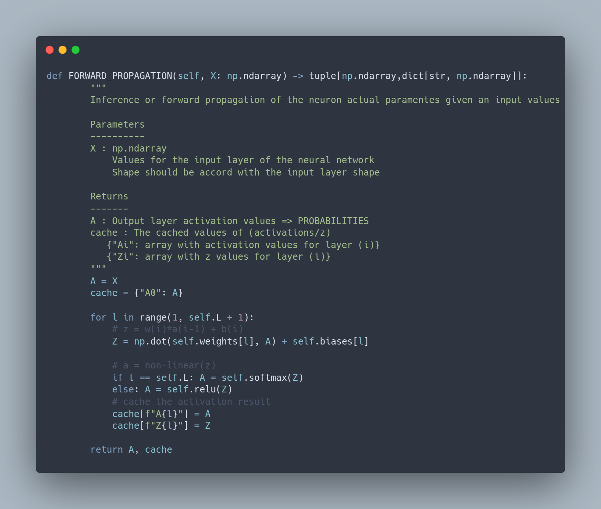
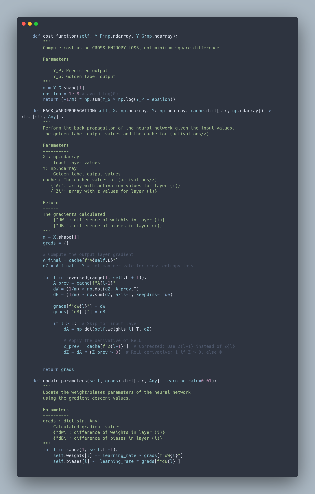

# Neural Network
Custom implementation of the vanilla neural network This repo is a learning proyect.

## Neural Network Implementation

This repository contains a vanilla neural network implemented from scratch using NumPy. The network is fully customizable, allowing users to define:

- Number of neurons in the **input layer**
- Number of neurons in each **hidden layer**
- Number of neurons in the **output layer**

The model follows standard deep learning techniques, including forward propagation, backpropagation, and gradient descent for parameter optimization.

---

### Architecture & Forward Propagation

Given an input **X**, the network performs forward propagation using the following equations:

For each layer $$l$$:  

$$Z^{(l)} = W^{(l)} A^{(l-1)} + b^{(l)}$$

where:  
- $$Z^{(l)}$$ is the weighted sum of inputs,  

- $$W^{(l)}$$ is the weight matrix,  

- $$A^{(l-1)}$$ is the activation from the previous layer,  

- $$b^{(l)}$$ is the bias term.  

The activation function applied is:  

**ReLU (Rectified Linear Unit) for hidden layers**:  
	$$A^{(l)} = \max(0, Z^{(l)})$$  
**Softmax for output layer**:  
	$$A^{(L)} = \frac{e^{Z^{(L)}}}{\sum e^{Z^{(L)}}}$$  


---

### Backpropagation & Parameter Updates

The network uses **cross-entropy loss** for classification:  


```math
\mathcal{L} = -\frac{1}{m} \sum \left( Y \log(A^{(L)}) + (1 - Y) \log(1 - A^{(L)}) \right)
```  

To update the weights and biases, the gradients are computed as follows:  

**Output layer gradient**:  
 $$dZ^{(L)} = A^{(L)} - Y$$  
**Hidden layer gradient**:  
 $$dZ^{(l)} = dA^{(l)} \cdot \mathbb{1}(Z^{(l)} > 0)$$ (ReLU derivative)  
**Gradient of weights and biases**:  
  $$dW^{(l)} = \frac{1}{m} dZ^{(l)} A^{(l-1)T}$$  
  $$db^{(l)} = \frac{1}{m} \sum dZ^{(l)}$$  

The parameters are updated using **gradient descent**:  

$$W^{(l)} = W^{(l)} - \alpha dW^{(l)}$$  
$$b^{(l)} = b^{(l)} - \alpha db^{(l)}$$  

where $$\alpha$$ is the **learning rate**.  


---

### API

#### Training & Metrics

- **Training**: The network trains using **mini-batch gradient descent** or **full-batch training** depending on user settings.  
- **Metrics**: During training, key evaluation metrics are computed, including **accuracy, precision, recall, and F1-score**.  

#### How to Use

1. **Initialize the network**:
    ```python
    model = NeuralNetwork(layers=[3, 5, 2])
    ```
2. **Train the model**:
    ```python
    model.TRAIN(X_train, Y_train, epochs=1000, learning_rate=0.01, batch_size=32, verbose=True)
    ```
3. **Test the model**:
    ```python
    model.TEST(X_test, Y_test, verbose=True)
    ```
4. **Save & Load parameters**:
    ```python
    model.save_model("parameters.npz")
    model.load_model("parameters.npz")
    ```

This implementation is designed for flexibility, allowing users to train neural networks with varying architectures while providing a simple interface for model training and evaluation.

## MNIST prediction implementation

### Dataset

## Dependencies
### Neural Network
The neural network is implemented form scratch, give that the goal was not to rewrite the matrix opeartions or implement the metrics operations the dependencies used are `numpy` for matrix operations and `sklearn` for the testing metrics.

### Training 
The Training dependencies used for the hand-written digit prediction are `pandas` for reading the dataset and parse it into `numpy` format. `matplotlib` & `pyqpt6` is used for the displaying hand-written digits of the database in graphical way.  
`pyproject.toml`
```toml
[project]
name = "vanilla-neural-networks"
version = "0.1.0"
description = ""
readme = "README.md"
requires-python = ">=3.12"
dependencies = [
    "matplotlib>=3.10.1",
    "numpy>=2.2.3",
    "pandas>=2.2.3",
    "pyqt6>=6.8.1",
    "scikit-learn>=1.6.1",
]
```


